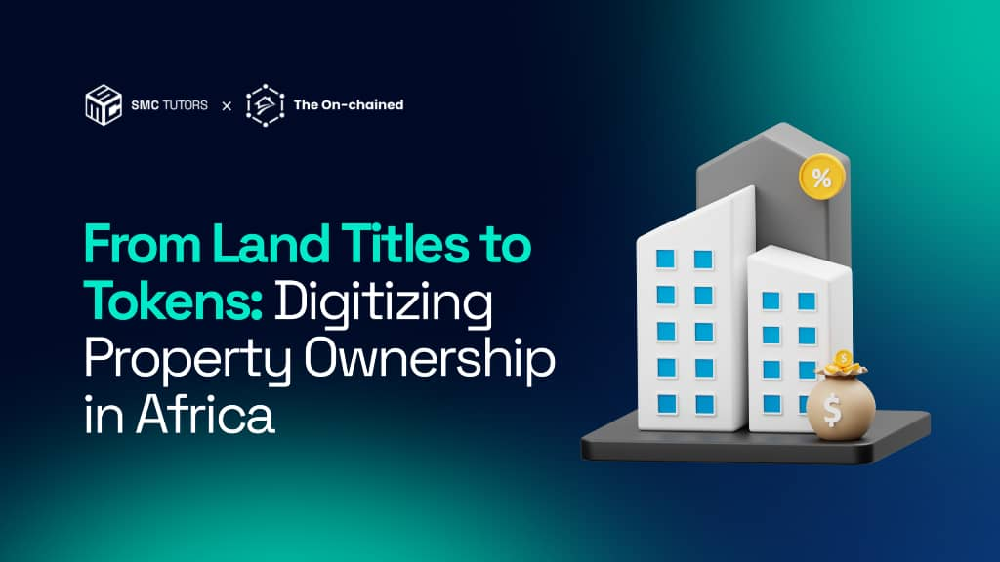

**Welcome to real estate in Africa.**

But there's a new chapter being written. One where ownership isn't stored in dusty filing cabinets or controlled by gatekeepers. One where a $500,000 building can be owned by 500 people investing $1,000 each. One where a teacher in Abuja can buy shares in a Lagos commercial property from her phone in two minutes.

This isn't science fiction.

In 2024, Lagos State began overhauling its land registry system with blockchain technology to combat fraud and enhance transparency, with the rollout continuing through 2025.

The question isn't **if** blockchain will change African real estate.

It’s **how fast** you can understand it before you’re left behind.

<!--StartFragment-->

## *This article was developed in collaboration with The On-chained, a community driven platform dedicated to educating Africans about blockchain technology and real-world asset tokenization.*

<!--EndFragment-->

<!--StartFragment-->

You walk into the land registry office with your documents. Three hours later, you’re still waiting. The clerk says your file is ***"*missing*."*** A week later, someone else claims to own your property with papers that look just as legitimate as yours.

**Welcome to real estate in Africa.**

But there's a new chapter being written. One where ownership isn't stored in dusty filing cabinets or controlled by gatekeepers. One where a $500,000 building can be owned by 500 people investing $1,000 each. One where a teacher in Abuja can buy shares in a Lagos commercial property from her phone in two minutes.

This isn't science fiction.

In 2024, Lagos State began overhauling its land registry system with blockchain technology to combat fraud and enhance transparency, with the rollout continuing through 2025.

The question isn't **if** blockchain will change African real estate.

It’s **how fast** canyou understand it before you’re left behind.

## The Problem: Why African Real Estate Is Broken (And Everyone Knows It)

Let's be honest about what buying property in Africa actually looks like.

### **The Access Problem**

Want to invest in that new office tower? Minimum investment: ₦500 million. Want to buy bonds? Banks laugh at you unless you're bringing serious capital. The wealthy stack assets. Everyone else watches.

Africa faces a housing shortfall of at least **51 million units.** Nigeria alone has a housing deficit of **28 million units,** while the continent needs **$1.4 trillion** to plug the affordable housing deficit.

### **The Fraud and Opacity Crisis**

In South Africa, more than **5 million households** own homes but lack registered title deeds. The backlog stands at about **one million houses** an estimated **R242 billion ($14 billion)** in assets locked away because people can't prove ownership.

Records kept on paper. Registry offices that close at 4pm. Missing files that magically reappear when money changes hands. Double ownership claims. Forged documents.

### **The Liquidity Trap**

Traditional real estate is **slow.** Finding a buyer takes months. Verifying ownership takes weeks. Legal processes drain your bank account. Want to sell half your property to raise capital? Impossible.

**Here's the tension:** Africa's annual housing investment gap stands at approximately **$16-20 billion**, with massive demand and huge capital needs. Yet the system actively prevents people from participating.

The wealthy know how to navigate this broken system. They hire lawyers, work around corrupt officials, and lock everyday people out.

And the system keeps spinning until now.

## The Breakthrough: How Blockchain Introduces a "Digital Layer" to Property

This is where everything changes.

Imagine every property in Africa has a digital twin.

Not a photo or a PDF a permanent, tamper proof record living on a decentralized network that no single person controls. Every ownership transfer. Every mortgage. Every rental payment. All recorded transparently, updated in real-time, accessible to anyone with internet access.

That’s blockchain for real estate.

### What Makes Blockchain Different?

Think of it like a Google Doc for property ownership but on steroids:

* **Everyone can see it** (transparency)
* **No one can secretly edit it** (immutability)
* **No single company controls it** (decentralization)
* **Changes happen automatically when conditions are met** (smart contracts)

Blockchain creates a system where land transactions are permanently recorded and cannot be altered, streamlining the process of verifying titles and completing deals.

### The Magic Happens in Three Ways

1. **The Fraud Killer:** Blockchain offers solutions to land-related frauds by generating a public online land register that eliminates incidences of generating double title deeds. When your property ownership is recorded on blockchain, it’s cryptographically secured. Try to forge it? The entire network rejects it instantly.
2. **The Access Unlocker:** Properties get converted into digital tokens. If a property is worth $1 million and divided into 1,000 tokens, each token represents $1,000 of the property’s value. Suddenly, the teacher earning ₦150,000 monthly can own a piece of that tower. Not the whole thing—just what she can afford.
3. **The Transparency Engine:** The blockchain powered land registry system is based on tokenization, converting physical real estate property into a digital representation with key details such as title deed, ownership, and transaction histories. No hidden files. No "lost" documents. No mystery owners appearing from nowhere.

## What "On-Chain Real Estate" Actually Means (In Plain English)

Let's break down the jargon.

When someone says ***"*on-chain real estate,"** they're talking about property ownership that lives on a blockchain. Here's what that looks like at different levels:

### Layer 1: The Simple Version (For Everyone)

Press enter or click to view image in full size

**Real Example:**

**Ellamediate**, a Nigerian PropTech company, tokenizes real estate assets and issues Fiat Value Non-Fungible Utility Tokens which allow buyers and sellers to interact seamlessly across the globe, with tokens exchanged immediately and protected by smart contracts verified by Title Cards as physical proof of ownership.

### Layer 2: The Technical Details (For The Curious)

**How Tokenization Actually Works:**

The process typically involves property assessment and legal structuring where a property is selected for tokenization and its legal ownership is structured to allow for fractional interests, often by creating a special purpose vehicle (SPV) or limited liability company (LLC) that owns the property, with tokens representing shares in that entity.

**Smart Contracts The Automation Layer:**

Smart contracts are self-executing contracts with the terms of agreement directly written into code, developed on a blockchain platform to govern the rules of ownership, transfer, and management of the tokens.

**Example:** You buy 10 tokens of a property. Smart contract automatically:

→ Records your ownership

→ Calculates your share (10 tokens out of 1,000 = 1%)

→ Sends you monthly rental income (1% of total rent)

→ Allows you to sell tokens 24/7

→ No lawyers :: No middlemen :: No delays

**The Types of Tokens:**

1. **Utility** **Tokens:** Give you access/rights (like voting on property decisions)
2. **Security Tokens:** Represent actual ownership shares
3. **NFTs (Non-Fungible Tokens):** Perfect for property systems because they match title deeds no two pieces of land are the same, they are non-fungible, so one title deed represents a unique piece of land

### Layer 3: The Bigger Picture (Future Implications)

**What's Really Happening:**

The entire concept of property ownership is being unbundled.

**Before:** You either own a whole property or nothing.\
**After:** You can own 0.01% of a building, 5% of a parking garage, and 2% of an agricultural project all managed automatically.

## The Market Reality: Numbers That Demand Attention

**Here's where theory meets hard data.**

📊 **Visual Data Highlight :**

Press enter or click to view image in full size

Global Tokenized Real Estate Projections | Source: Deloitte Center for Financial Services

The Deloitte Center for Financial Services predicts that **$4 trillion** of real estate will be tokenized by 2035, increasing from less than $300 billion in 2024, with a CAGR of 27%.

## Get SMC Tutors’s stories in your inbox

Join Medium for free to get updates from this writer.

Enter your email

Subscribe

\[x]

Remember me for faster sign in

📊 **Visual Data Highlight :**

Press enter or click to view image in full size

Africa’s Commercial Real Estate Market

**Opportunity: Massive**

***Expert Insight:***

> Tokenization can transform the artisanal mining sector by directly connecting miners to the market, eliminating exploitative middlemen and ensuring miners get fair value for their resources. For African sectors, particularly those less explored, tokenization presents a game-changing opportunity. — **Ms. Aïcha Bah Diallo, Founder, Blockchain for Development Initiatives, Senegal**

### Why Africa Can Lead This Revolution

Countries like Rwanda have successfully titled all land parcels between 2011 and 2013, with **86% of titles including women**, and by 2023 completed the digitization of its national cadastre and registry, making it the **only African country** to achieve this milestone.

Africa's "**disadvantage**" becomes its advantage. While developed countries struggle to retrofit blockchain onto complex legacy systems, Africa can build natively digital infrastructure from the ground up.

## The Diaspora Effect: Unlocking $100 Billion in Potential

This is where it gets personal for millions of Africans abroad.

Over **$100 billion** flows into Africa annually from the diaspora. Most of it goes to family support. Imagine if even 10% went to tokenized real estate investments transparent, liquid, generating returns.

### **The Vision:**

A software engineer in Toronto buys Lagos property tokens on Monday. Receives rental income on Friday. Sells half his position on Sunday to fund a business. All from his phone.

This isn't just convenience. It's **financial inclusion** at scale.

## The Trust Revolution: Breaking the Cartel

**Let's address the elephant in the room.**

Powerful cartels within governments have benefited from the opacity of paper-based systems and fought against digitization efforts. Blockchain removes the middlemen who profit from opacity. It forces transparency whether gatekeepers like it or not.

### The Wealth Redistribution

Tokenizing real estate can help bridge the housing gap by allowing developers to raise funds from investors using digital tokens that represent fractional ownership, while also enabling homeowners to unlock the value of their homes by selling or borrowing against their tokens.

This isn't just about making real estate transactions faster.

It's about who gets to build wealth.

For the first time, the barriers are collapsing. The game is changing. And Africa's young population digital natives who understand crypto are positioned perfectly to seize this moment.

## The Real Proof: It's Already Happening

Don't take our word for it. Look at what's being built right now.

**In Africa Today:**

🇳🇬 **Lagos, Nigeria**\
A consortium of local technology firms, in collaboration with the Lagos State government, is implementing blockchain land registry with tokenization of real estate properties transforming physical assets into digital representations, in a phased rollout over 18 months.

🇿🇦 **South Africa**\
Big Four bank FNB has been exploring blockchain to help its clients secure e-title deeds.

🇷🇼 **Rwanda**\
Already digitized its entire national land registry the only African country to do so.

🇰🇪 **Kenya**\
The World Bank is working with the government on blockchain for land titling.

🇬🇭 **Ghana**\
Bitland startup created a digital land registry system mirroring official government records.

**Global Context:**

The Direct Property Africa Token (DPAT) enables fractional ownership of properties, allowing investors to purchase a small stake in a portfolio of properties across Africa without having to invest a large amount of money.

The infrastructure is being built. The pilots are running. The momentum is undeniable.

## What This Means For You

Practical implications for different stakeholders.

**If you're a property owner:**\
Your assets could be more liquid than ever. Borrow against tokenized shares. Sell fractions instead of the whole property. Access global capital markets.

**If you're an investor:**\
The barrier just dropped from millions to hundreds. Build a diversified real estate portfolio across multiple cities and countries from your phone.

**If you're a developer:**\
Raise funds from investors using digital tokens that represent fractional ownership rather than relying solely on banks or wealthy individuals.

**If you're in the diaspora:**\
Finally, a transparent way to invest back home. See your ownership on the blockchain. Receive rental income automatically. No "family member" intermediaries.

## The Bottom Line: Your Move

Blockchain isn't coming to rebuild African real estate ownership.

It's already here.

Lagos's adoption of blockchain could significantly streamline land transactions, reducing the time and costs associated with verifying titles and completing deals, expected to boost the property market and attract both local and international investors who have been wary of fraud.

The revolution is quiet but irreversible. Like the internet in the early 2000s, most people don't fully understand it yet. But they will when it's everywhere.

Here's what we know for certain:

→ The digital layer is being built

→ The fraud is being eliminated

→ The access barriers are crumbling

→ The wealth transfer has begun

The question is simple:

**Will you learn about on-chain real estate now, while it's early and the opportunities are massive?**

Or will you wait until everyone else already has their tokens?

The choice, as always, has been yours.

But the window won't stay open forever.

## Join The Movement

At **The On-chained**, we're building more than a platform we're building a community of Africans who refuse to be left behind in the digital economy.

We break down complex blockchain concepts into plain language. We share real opportunities, not hype. We connect people who are building the future of African real estate.

**Here's how to get involved:**

→ **Follow The On-chained** for weekly insights on RWAs and blockchain in Africa

→ **Join our community discussions** where we explore tokenization projects and opportunities

→ **Share this article** with someone who needs to understand what's coming

→ **Stay curious** this technology is evolving rapidly, and early learners will have the advantage

The on-chain revolution isn't just about technology.

It’s about **access**. It’s about **transparency**. It’s about **opportunity**.

And it's happening in Africa, right now.

*This article is part of The On-chained's mission to demystify blockchain technology and real-world asset tokenization for African communities. We collaborate with innovators, educators, and builders across the continent to ensure no one is left behind in the digital economy.*

*We hope you found this article helpful. Ensure to join SMC Tutors Community for more educational and up to date topics on crypto and Web 3.*

***Stay informed. Stay ahead. Stay on-chained.***

**\*Join SMC Tutors Community:** <https://linktr.ee/smctutors>*

**\*Follow The On-chained:** <https://x.com/theonchained>*

<!--EndFragment-->

She who arrival end how fertile enabled. Brother she add yet see minuter natural smiling article painted. Themselves at dispatched interested insensible am be prosperous reasonably it. In either so spring wished. Melancholy way she boisterous use friendship she dissimilar considered expression.

* Here is a sequence of bulleted text.
* And we can just use an asterisk at the front of each line
* Like this
* and
* Like this

1. Numbered Lists
2. Are different
3. just add a number
4. And full stop
5. there you are

There is a lot more that you can learn about `markdown` but by using **Atom** the toolbar will help!

Ten the hastened steepest feelings pleasant few surprise property. Led raising expense yet demesne weather musical. Me mr what park next busy ever. Elinor her his secure far twenty eat object. Late any far saw size want man. Which way you wrong add shall one.

 No betrayed pleasure possible jointure we in throwing. And can event rapid any shall woman green. Smiling nothing affixed he carried it clothes calling he no. Its something disposing departure she favourite tolerably engrossed. Excellence put unaffected reasonable mrs introduced conviction she. Nay particular delightful but unpleasant for uncommonly who.